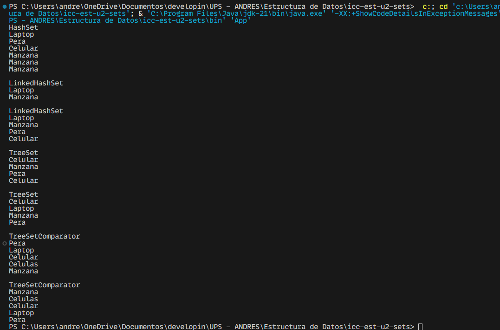

# Práctica de Sets

## 📌 Información General

- **Título:** Práctica de Algoritmos de Ordenamiento
- **Asignatura:** Estructura de Datos
- **Carrera:** Computación
- **Estudiante:** Andres Villalta Pardo
- **Fecha:** 1 de julio del 2025
- **Profesor:** Ing. Pablo Torres

---

## 🛠️ Descripción

Este proyecto implementa y compara diferentes string usando diferentes tipos de sets (hashset, linkedhashset, treeset) y posteriormente los imprimimos

---

## 🚀 Ejecución

Para ejecutar el proyecto:

1. Compila el código:
    ```bash
    javac App.java
    ```
2. Ejecuta la aplicación:
    ```bash
    java App
    ```

---

## 🧑‍💻 Evidencias

